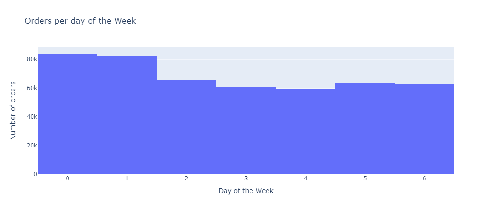
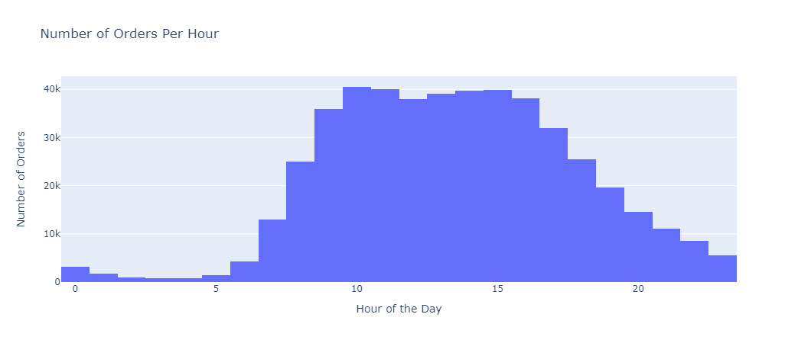

# Instacart

## Overview
- Review purchases made from instacart users

## What is the reason for the project
- Time during the day in which most order were placed
- The busiest days of the week
- How many days on average customers take to place another order

## Images

## Technologies
- This was written Jupyter Notebook and Python
